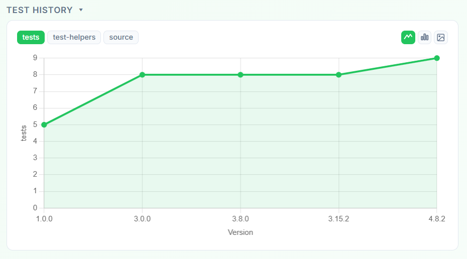

# Explorando Práticas de Teste

Neste exercício, vamos explorar práticas de teste em sistemas reais utilizando a ferramenta [TestMiner](https://andrehora.github.io/testminer).

O TestMiner permite visualizar e analisar testes de software em repositórios do GitHub, fornecendo dados sobre como os projetos organizam seus testes, como eles evoluem entre versões e quais bibliotecas de teste são utilizadas.
Explore a ferramenta antes de começar para se familiarizar com seu funcionamento.

---

## Passo 1: Selecionar um repositório

Escolha um repositório real que possua testes escritos na linguagem de sua preferência.
Abaixo estão alguns links para ajudá-lo a encontrar projetos interessantes:

- **Python:** https://github.com/topics/python?l=python
- **JavaScript:** https://github.com/topics/javascript?l=javascript
- **TypeScript:** https://github.com/topics/typescript?l=typescript
- **Java:** https://github.com/topics/java?l=java

## Passo 2: Explorar o repositório selecionado

Busque o repositório escolhido no [TestMiner](https://andrehora.github.io/testminer) e analise os dados de teste gerados pela ferramenta.

## Passo 3: Explicar uma prática de teste

Com base nos dados obtidos, selecione uma prática ou dado de teste relevante e explique-o com suas próprias palavras.

---

## Instruções de entrega

1. Faça um `fork` deste repositório (saiba mais sobre forks [aqui](https://docs.github.com/pt/pull-requests/collaborating-with-pull-requests/working-with-forks/fork-a-repo)).
2. Responda às questões abaixo diretamente neste arquivo `README.md` do seu fork. Pode adicionar imagens para enriquecer sua explicação.
3. No Moodle, submeta apenas a URL do seu fork.

---

## Respostas

**1. Repositório selecionado:** https://github.com/msiemens/tinydb

**2. Explicação:** 

    Esse gráfico mostra o número de testes para diferentes versões do repositório. O projeto nasceu simples, com poucas 
funcionalidades e uma suíte de testes cobrindo o essencial, o que explica o número inicial baixo de 5 testes na versão 1.0.0 .
Depois desse período, houve um grande crescimento do número de features, o maior registrado, havendo uma reformulação completa
do modelo de queries, por exemplo, o que levou à necessidade de um maior número de testes para cobrir novos comportamentos na versão 3.0.0 .
    Já nas versões 3.8.0 e 3.15.2, o número de testes ficou estável, o que faz sentido, considerando que houveram melhorias 
incrementas e correções de bugs, mas sem grandes reestruturações, o que é indicado inclusive pelo número das versões, pois, de acordo com a lógica de número de versões sendo "Major.minor.patch", as alterações dessas versões em relação à 3.0.0 foram menores, o que contribui para a estabilização do número de testes. Esse trecho do gráfico sugere que nessa fase o projeto atingiu certa maturidade.
    Por fim, a versão 4.8.2 trouxe breaking changes significativos, como remoção de suporte ao Python 2 e de classes, por exemplo,
em relação à versão 3.15.2 (mais uma vez indicado pelos números das versões), o que explica o aumento no número de testes.